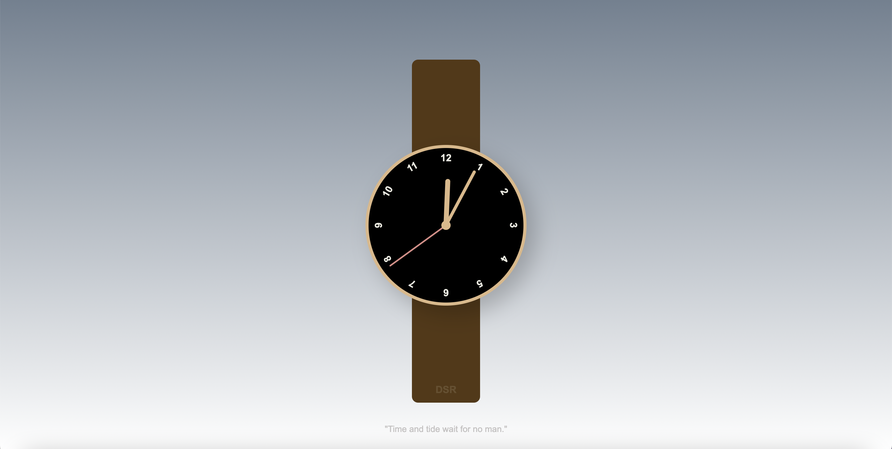
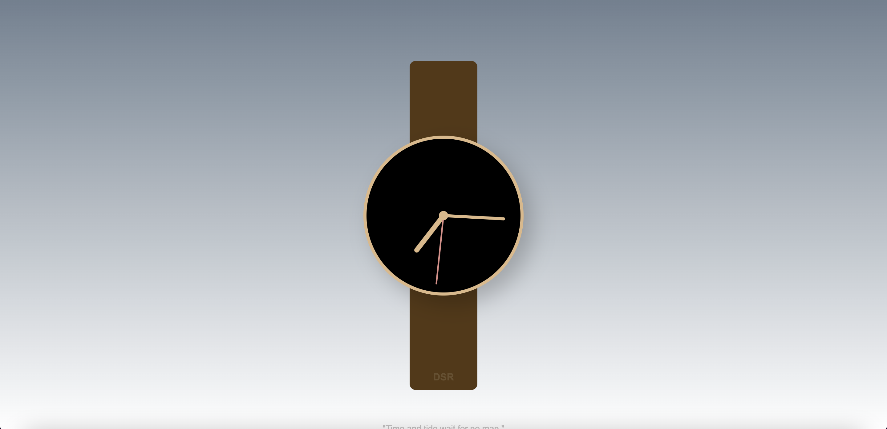

# Wrist Watch
## Description
A wristwatch that reflects respective EDT/EST.

I completed this project to improve upon my JavaScript skills and CSS skills. 

Technologies Used: HTML, CSS, and JavaScript. 

Check it out: [Wristwatch](https://ctrlaltree.github.io/analogWatch/)

## Visual

With numbers:

Without numbers:

